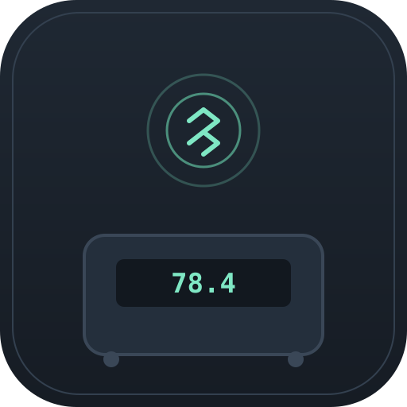

  

<h1 align="center">Smart Scale</h1>

  A browser-based Web Bluetooth client for the <code>IF_B2</code> BLE body-composition scale — no app, no account, no cloud.

## What this is

`IF_B2` scales (and the wider family of white-label BLE body-fat scales built on this
chipset) talk over a simple GATT protocol: connect, subscribe to notifications, send a
handshake, and the scale streams back a weight + bioimpedance reading. This repo is a
single self-contained HTML page that speaks that protocol directly from the browser via
the [Web Bluetooth API](https://developer.mozilla.org/en-US/docs/Web/API/Web_Bluetooth_API) —
open it, click connect, step on the scale.

It also estimates the body-composition numbers the vendor app shows (BMI, body fat %,
water %, muscle %, bone %, BMR, daily energy) from the raw weight + impedance reading,
using published bioelectrical-impedance research formulas — see
[Body composition estimates](#body-composition-estimates) below for exactly which ones
and why they won't be a byte-for-byte match to the vendor app.

## Quick start

1. Open `index.html` in **Chrome or Edge** (desktop, or Android — Web Bluetooth isn't
   available in Safari/iOS or Firefox). Serve it over `https://` or open it as a local
   file — Web Bluetooth needs a secure context.
2. Fill in your sex, height, age and activity level once (saved locally in your browser,
   never sent anywhere).
3. Click **Connect to scale**, pick `IF_B2` from the browser's device picker, and step on.
4. Weight, impedance, and the derived composition metrics update live. The protocol log
   at the bottom shows every raw byte sent and received — handy for debugging or for
   reverse-engineering additional scale commands (see below).

Enable **GitHub Pages** on this repo (Settings → Pages → Deploy from branch → `main` /
root) to get a hosted `https://<your-username>.github.io/Smart-Scale/` link so you can
open it on your phone without hosting it yourself.

## GATT protocol

| | |
|---|---|
| Device name | `IF_B2` |
| Service UUID | `0xFFF0` |
| Write characteristic | `0xFFF2` (WRITE, WRITE NO RESPONSE) |
| Notify characteristic | `0xFFF1` (NOTIFY, READ) |

Connection sequence: discover `0xFFF0` → subscribe to notifications on `0xFFF1` (writes
the `0x2902` CCCD descriptor) → write a 10-byte handshake frame to `0xFFF2`
(`FD 01 00 00 00 00 00 00 00 00`) → the scale replies with a 14-byte notification.

Weight is bytes 4–5 (little-endian uint16, ÷10 for kg); raw bioimpedance is bytes 8–9
(little-endian uint16, Ω).

The scale also exposes a second GATT service,
`f000ffc0-0451-4000-b000-000000000000`, which is Texas Instruments' publicly documented
**OAD (Over-the-Air Download)** firmware-update profile — not scale data. It's left alone
here; writing to it incorrectly can brick the device.

### Finding more commands

The handshake above is one known command. Other vendor-app actions (unit switching,
multi-user selection, history retrieval) almost certainly use other opcodes on `0xFFF2`
that haven't been mapped yet. The built-in **raw frame sender** in the protocol log panel
lets you fire arbitrary hex bytes at `0xFFF2` and watch the `0xFFF1` reply live, which
is useful for testing candidates captured from an Android Bluetooth HCI snoop log while
using the real vendor app. Contributions mapping new opcodes are welcome.

## Body composition estimates

IF_B2's own calibration constants are proprietary and unpublished, so the numbers here
are computed from published, peer-reviewed general-adult-population formulas instead of
guessed vendor constants:

- **BMR** — Mifflin-St Jeor equation (Mifflin et al., *Am J Clin Nutr*, 1990).
- **Body fat % / body water %** — a resistance-based regression of the form
  `a + b·(height²/impedance) + c·sex + d·weight − e·age`, from adult BIA
  cross-validation literature.
- **Muscle % / bone %** — fat-free mass minus a population-average bone-mass share
  (consumer BIA hardware can't directly measure bone mineral content either — every
  vendor app is estimating this the same way).

Expect these to land in the same range as the vendor app but not match exactly.
"Health Score" and "Body Age" from the vendor app are proprietary marketing scores with
no public formula, so they're intentionally left out rather than fabricated.

## Browser support

Requires the Web Bluetooth API: Chrome or Edge on desktop, ChromeOS, or Android. Not
available on iOS (any browser) or desktop Firefox/Safari — this is a platform
limitation, not something fixable in this codebase.

## Privacy

Everything runs client-side. Your profile inputs are stored only in your browser's
`localStorage`; no data is sent to any server.

## License

[MIT](LICENSE)
